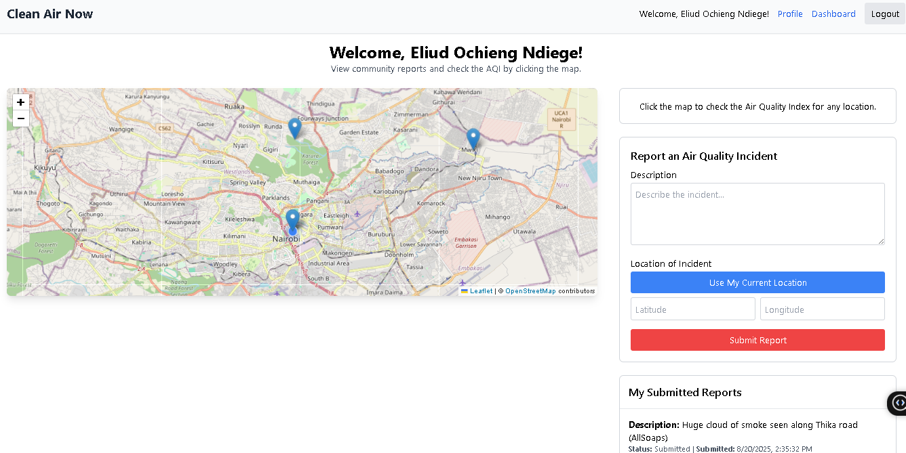

# Clean Air Now: A Full-Stack MERN GIS Application

**Live Application:** [**https://clean-air-now.vercel.app/**](https://clean-air-now.vercel.app/)



**Clean Air Now** is a responsive, full-stack web application designed to empower communities with real-time, accessible, and actionable environmental data. It provides an interactive GIS map to visualize the Air Quality Index (AQI) and allows users to report and view local pollution incidents as they happen. The platform also features a personalized alert system, notifying users via email when air quality in their saved locations becomes poor.

## 🌐 Live Demo & Links

* **Live Frontend (Vercel):** **[https://clean-air-now.vercel.app](https://clean-air-now.vercel.app)**
* **Live Backend (Render):** **[https://clean-air-now-server.onrender.com](https://clean-air-now-server.onrender.com)**
    *(Note: This is the API URL. Visiting it directly in a browser will show a "Cannot GET /" message, which is expected.)*

---

## ✨ Key Features

* **Interactive GIS Map:** A dynamic and responsive map built with **Leaflet**, displaying the user's high-accuracy live location and community-submitted incident reports.
* **Real-Time AQI Monitoring:** Fetches and displays real-time Air Quality Index data from the OpenWeather API for any point on the map, triggered by a simple click.
* **Live Community Reporting:** Users can submit pollution incident reports with a description and location. New reports are broadcast instantly to all connected clients using **Socket.IO** without needing a page refresh.
* **Personalized Email Alerts:** A **cron job** on the backend runs hourly, checking the AQI at users' saved "Favorite Locations" and automatically sending email alerts via Nodemailer if the quality is poor.
* **Historical Data Charts:** Displays a 7-day trend chart for the AQI at any selected location, allowing users to analyze recent pollution patterns.
* **Secure User & Profile Management:** Complete user system with JWT-based authentication for registration, login, profile updates, and a secure "Forgot Password" email flow.
* **Role-Based Admin Dashboard:** A secure admin-only panel for viewing all user reports and moderating content by updating a report's status.
* **Fully Responsive Design:** A mobile-first UI built with **Tailwind CSS** that provides a seamless experience on devices of all sizes, from mobile phones to desktops.

---

## 🛠️ Technology Stack

This project leverages the MERN stack and other modern technologies to create a robust and real-time experience.

| Category | Technology |
| :--- | :--- |
| **Frontend** | React, React Router, Tailwind CSS, Axios, Vite |
| **Backend** | Node.js, Express.js |
| **Database** | MongoDB (with Mongoose & GeoJSON) |
| **Real-Time**| Socket.IO |
| **GIS** | Leaflet, React-Leaflet, Leaflet-Geosearch |
| **Authentication** | JSON Web Tokens (JWT), bcrypt.js |
| **Scheduled Jobs** | node-cron |
| **Email Service** | Nodemailer, Mailtrap (for development) |
| **Deployment**| Vercel (Frontend), Render (Backend), MongoDB Atlas (DB) |
| **Security**| `express-rate-limit`, `express-validator` |

---

## 🚀 Local Development Setup

To run this project on your local machine, follow these steps:

### Prerequisites

* Node.js (v18 or later)
* `pnpm` package manager
* A MongoDB Atlas account and a free [Mailtrap.io](https://mailtrap.io) account.

### 1. Clone the Repository

```bash
git clone [YOUR GITHUB REPO LINK]
cd clean-air-now
2. Backend Setup (/server)
Navigate to the server directory: cd server
Install dependencies: pnpm install
Create a .env file in the /server directory and add the following variables with your own credentials:
code
Env
MONGO_URI=<your_mongodb_atlas_connection_string>
JWT_SECRET=<your_jwt_secret>
OPENWEATHER_API_KEY=<your_openweather_api_key>
FRONTEND_URL=http://localhost:5173

# Mailtrap Credentials
EMAIL_HOST=sandbox.smtp.mailtrap.io
EMAIL_PORT=2525
EMAIL_USER=<your_mailtrap_user>
EMAIL_PASS=<your_mailtrap_pass>
EMAIL_FROM="Clean Air Now <noreply@cleanairnow.com>"

# Feature Toggles
REPORT_EXPIRATION_HOURS=24
AQI_ALERT_THRESHOLD=4
Start the backend server (runs on http://localhost:5000):
code
Bash
pnpm run dev
3. Frontend Setup (/client)
Open a new terminal window.
Navigate to the client directory: cd client
Install dependencies: pnpm install
The frontend will automatically connect to the local backend as defined in client/src/apiConfig.js.
Start the frontend development server (runs on http://localhost:5173):
code
Bash
pnpm run dev
